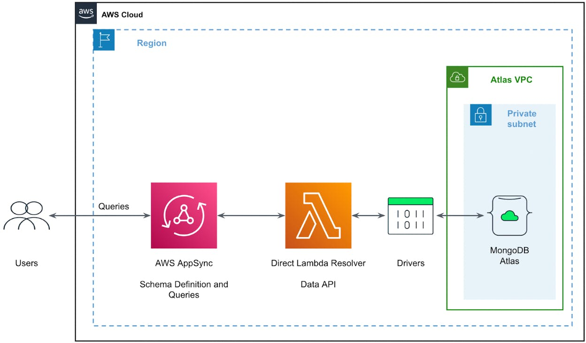

# Keeper

This is a full-stack note-taking web application that mimics the basic functions of [Google Keep](https://keep.google.com/).

A complete working demo [here](https://main.d9r6xa56gbymc.amplifyapp.com/). 

## Features

- A MERN (MongoDB + Express.js + React.js + Node.js) full stack project
- A serverless application deployed with AWS Amplify 
- Deployed and hosted via AWS Amplify on the AWS global content delivery network (CDN)

## Technologies

- [React.js](https://reactjs.org/)
- [axios](https://github.com/axios/axios)

- [Node.js](https://nodejs.org/)
- [Express](https://gulpjs.com/)
- [MongoDB](https://webpack.js.org/concepts/)
- AWS Amplify and AppSync

The above figure taken from [MongoDB](https://www.mongodb.com/blog/post/modernize-graphql-api-mongodb-atlas-aws-app-sync) shows how the AWS AppSync endpoint leverages resolvers to connect to MongoDB Atlas. Instead of the Lambda Resolver, this projected implemented a pipeline resolver for AppSync connection.

## Notes

Please note that the serverless backend was deployed via multiple middlewares, which may cause the app to occasionally malfunction. 